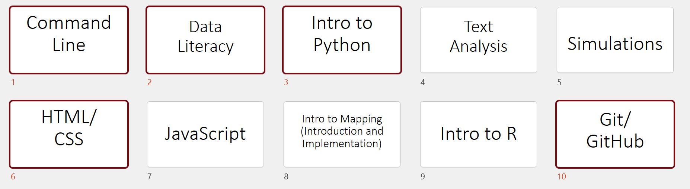

# Digital Humanities Resource Infrastructure for Teaching Technology

DHRIFT has learning pathways for building and practicing foundational digital skills, including data literacy, quantitative analysis, web development, Python, for humanistic projects.

Data Literacy

Quantitative Analysis

Web Development

Python

Data Visualization